# Table of Contents

- [Table of Contents](#table-of-contents)
- [Graphs](#graphs)
- [Graph Theory](#graph-theory)
- [Types of Graphs](#types-of-graphs)
- [Weighted Graphs](#weighted-graphs)
- [Special Graphs](#special-graphs)
- [Representing Graphs](#representing-graphs)
  - [Adjacency Matrix](#adjacency-matrix)
  - [Adjacency List](#adjacency-list)
  - [Incidence Matrix](#incidence-matrix)
  - [Edge List](#edge-list)
- [Common Graph Theory Problems](#common-graph-theory-problems)
  - [Overview](#overview)
  - [Shortest Path Problem](#shortest-path-problem)
  - [Connectivity Problem](#connectivity-problem)
  - [Negative Cycles Problem](#negative-cycles-problem)
  - [Strongly Connected Components](#strongly-connected-components)
  - [Travelling Salesman Problem](#travelling-salesman-problem)
  - [Bridges](#bridges)
  - [Articulation Points](#articulation-points)
  - [Minimum Spanning Tree (MST)](#minimum-spanning-tree-mst)
  - [Flow Network - Max Flow](#flow-network---max-flow)
- [Depth-First Search](#depth-first-search)
  - [Overview](#overview-1)
  - [Basic DFS](#basic-dfs)
- [Has](#has)
- [Connected Components](#connected-components)

---

# Graphs

Graphs are collections of things and the relationships or connections between them.

- The data in a graph are called **`nodes`** or **`vertices`**.
- The connection between the vertices are called **`edges`**.

> **Note:** A neighbour node is a node that is accessible by traversing across a single edge from the current node.

One example of a graph is a social network, where the vertices are you and other people and the edges are whether two people are friends with each other.

---

# Graph Theory

> **Graph Theory is the mathematical theory of the properties and applications of graphs (networks).**

Graphs can be used to represent almost any problem which makes them very interesting because they pop up almost everywhere. A simple problem that can be phrased as a graph theory problem:

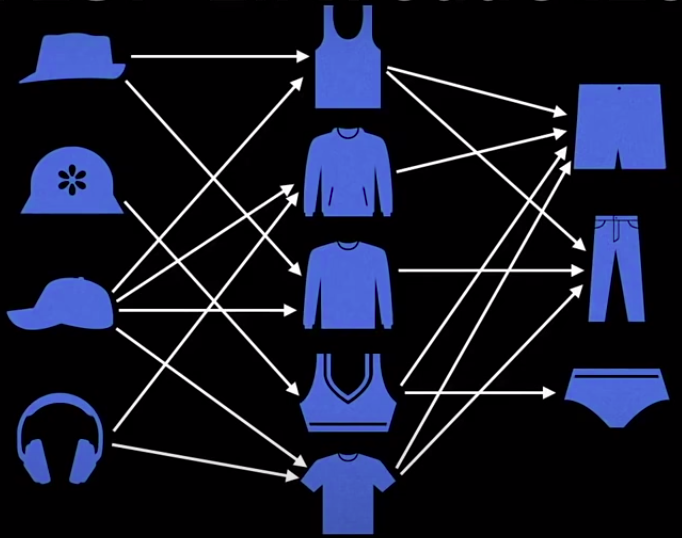

Given the constraints in this picture, how many different sets of clothes can I make choosing an article from each category. Of course, this could be phrased and solved using only mathematics. But the advantage to graph theory is that, it allows us to visualize the problem using **`nodes`** to represent an article of clothing and **`edges`** to represent relationships between them.

Another canonical example of a graph theory problem is a social network of friends.

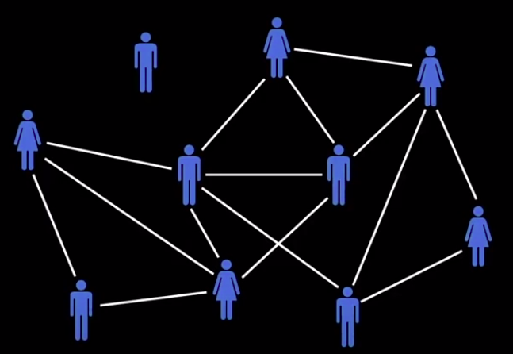

A graph representation enables us to answer interesting questions such as:

- How many friends does Person X have?
- How many degrees of separation are there between Person X and Person Y?

---

# Types of Graphs

There are many types of graph representations and it is really important to be able to recognize what type of graph you are working with, and especially when you are programming and trying to solve a particular problem.

1. **Undirected Graph** - An **`undirected graph`** is a graph in which edges have no orientation. The edge `(u, v)` is identical to the edge `(v, u)`. E.g. A social network or a city's road network that has bi-directional roads.
2. **Directed Graph** - A **`directed graph`** or **`digraph`** is a graph in which the edges have orientations. E.g. The edge `(u, v)` is the edge from `node u` to `node v`.

   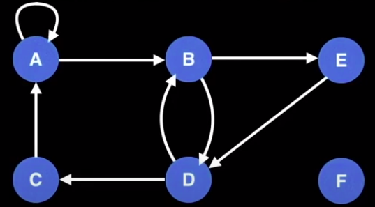

   In the graph above, this graph could represent people who bought each other gifts. The `nodes` could represent people and an edge `(u, v)` could represent that Person `u` who bought Person `v` a gift. So an incoming edge represents receiving a gift and an outgoing edge represents giving a gift. Therefore Person E in this graph bought person D a gift, Person A bought themselves AND Person B a gift and Person F bought nobody any gifts nor received a gift.

---

# Weighted Graphs

So far we have only seen unweighted graphs, but edges on graphs can contain weights to represent arbitrary values, such as cost, distance, quantity etc. Weighted graphs come in both directed and undirected flavours.

> **Note:** We will be denoting an edge of a graph as a triplet `(u, v, w)` where,
>
> - **`u`** - The node the edge is coming from
> - **`v`** - The node the edge is going to
> - **`w`** - The weight of the edge
>
> Also with this notation, we will also have to specify if the graph is `directed` or `undirected`.

---

# Special Graphs

We need to discuss quickly about special types of graphs in Graph Theory. There are so many types of graphs. The most important ones are:-

1. **`Tree`** - A Tree is simply an undirected graph with no cycles. There are several equivalent definitions of a Tree, for e.g. - It is a graph with `n` nodes and `n - 1` edges.

   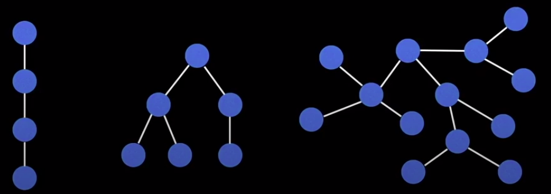

2. **`Rooted Tree`** - A related but totally different type of graph is a Rooted Tree. A rooted tree is a tree that has **a designated root node** where every other edge either points away from or towards the root node. When edges point away from the root node, the graph is called an **arborescence** (out-tree) and when edges point towards the root node, the graph is called an **anti-arborescence** (in-tree).

   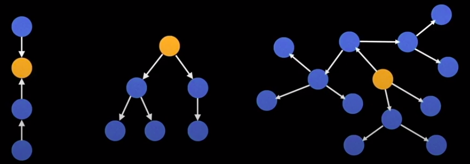

3. **`Directed Acyclic Graphs (DAGs)`** - DAGs are **directed graphs with no cycles**. These graphs are fairly common and are very important in computer science since they often represent structures with dependencies, such as a scheduler, a build system, a compiler or perhaps a more relatable University class pre-requisites.

   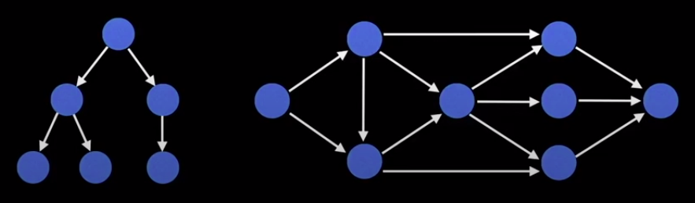

   There are several efficient algorithms that exist to deal specifically with DAGs like, "How to find the shortest path and produce a topological order of nodes". A topological ordering of nodes is an ordering of nodes that tells you how to process the nodes of a graph so you don't perform a task before first having completed all its dependencies. For example: A topological of Class pre-requisites would tell you to take Intro Biology and Intro Chemistry before taking a class of Genomics.

   > **Note: All out-trees are DAGs but not all DAGs are out-trees.**

4. **`Bipartite Graph`** - A Bipartite Graph is one whose vertices can be split into two independent groups, U, V, such that every edge connects between U and V. Other definitions exist such as: The graph is two colourable or there is no odd-length cycle.

   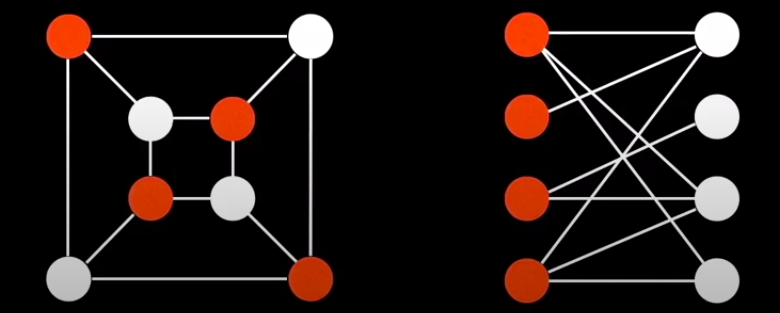

   Often a problem we like to ask is, "What is the maximum matching we can create on a Bipartite Graph?" Suppose white nodes are jobs and red nodes are people, then we can ask, "How many people can be matched to jobs?" In this case, there are a lot of edges in each graph, so the answer for both is 4. But in general, it's not so easy, if there are less edges, tougher constraints and more conflicts. Bipartite graphs also play a critical role in the field of network flow, which we will talk about later.

5. **`Complete Graph`** - A Complete Graph is one where there is a unique edge between every pair of nodes. A complete graph with **`n`** vertices is denoted as the graph **`K``n`**.

   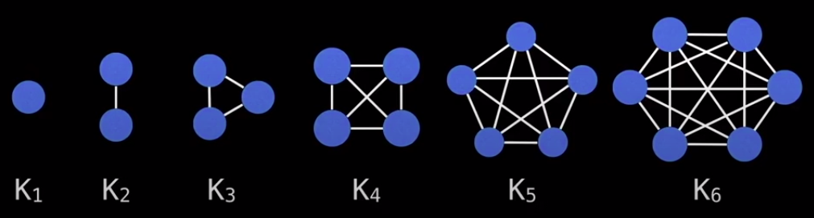

   Complete graphs are often seen as the worst-case-possible graphs that you can possibly encounter because of how many edges there are. So if you want to test your algorithm for performance, a complete graph is an easy way to start.

---

# Representing Graphs

One thing we are going to have to be really cognizant about is how we're actually representing our graphs on the computer. This isn't just what type of graph it is, but what type of data structure are we representing our graph with. This can have a huge impact on performance.

## Adjacency Matrix

The simplest way to represent a graph is inside a 2D Adjacency Matrix.

An **`Adjacency Matrix`** is a two-dimensional array where each nested array has the same number of elements as the outer array. The idea is that in an adjacency matrix **`m`**, every cell **`m[i][j]`** represents the edge weight of going from node **`i`** to node **`j`**.

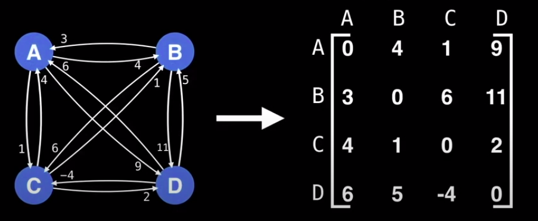

In the graph above, there are four nodes. So we create a `4 x 4 matrix` and populate the graph with the edge weights. If you look at the edge weight from Node `C` to Node `D`, you'll see that it has the edge weight of `2`. So in Row 3 and Column 4 of the Matrix, there is a value of `2`.

> **Note:** It is often assumed that the edge of going from a node to itself has a cost of zero. This is why the diagonal of the Matrix has all `0` values.

This matrix representation has several advantages:

<!--prettier-ignore-->
| Pros                                          | Cons                                      |
| --------------------------------------------- | ----------------------------------------- |
| Space efficient for representing dense graphs, i.e. graphs with lot of edges | Requires **`O(V``2``)`** space. In practice, graphs with over 10,000 nodes, start to become infeasible very quickly. |
| Edge weight lookup is **`O(1)`** | Iterating over all edges takes **`O(V``2``)`** time. This is great for dense graphs with lots of edges but not so great for sparse graphs, since most of the cells would be empty. |
| Simplest graph representation | |

---

## Adjacency List

The main alternative to the Adjacency Matrix is the Adjacency List.
An **`Adjacency List`** is a way to represent a graph as a map from nodes to lists of edges. The idea is that each node tracks all of it's outgoing edges.

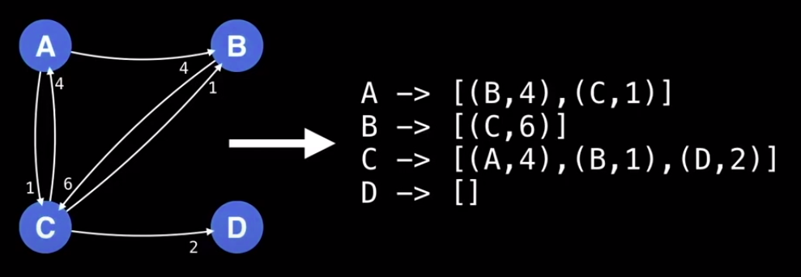

For example, in the graph above, the Node C has three outgoing edges. So the map entry for C will track the edge from C to A with cost 4, the edge from C to B with cost 1 and C to D with cost 2.
This will be denoted as `C => [["A", 4], ["B", 1], ["D", 2]]`

Notice that in the list of edges, we only need to track two things:-

- The destination node
- The cost to get to the destination node

We don't need to keep track of where we came from because that'll be implicitly known.

<!--prettier-ignore-->
| Pros                                           | Cons                                       |
| ---------------------------------------------- | ------------------------------------------ |
| Space efficient for representing sparse graphs | Less space efficient for dense graphs      |
| Iterating over all edges is efficient          | Edge weight lookup is **`O(E)`**. In practice one rarely or ever needs to actually do this.    |
|                                                | Slightly more complex graph representation |

---

## Incidence Matrix

Like the Adjacency Matrix, the Incidence Matrix is a Two-Dimensional Array. The difference is that the rows and columns mean something else here.

The Adjacency Matrix uses both rows AND columns to represent nodes.

The Incidence Matrix uses rows to represent nodes and the columns to represent edges.

This means, we can have an uneven number of rows and columns. Each column would represent an unique edge. Also, each edge connects two nodes. To show that there is an edge between two nodes, we put a 1 in the two rows of a particular column.
For a directed graph, we use 1 for an edge leaving a particular vertex and -1 for an edge entering a node.

---

## Edge List

An **`Edge List`** is a way to represent a graph simply as an unordered list of edges. Assume the notation for any triplet `(u, v, w)` means: **_"the cost from node `u` to node `v` is `w`"_**

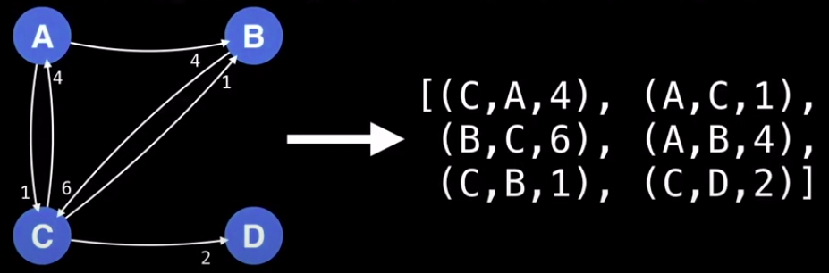

This notation is seldom used because of its lack of structure. However, it is conceptually simple and practical in a handful of algorithms.

<!--prettier-ignore-->
| Pros                                           | Cons                                  |
| ---------------------------------------------- | ------------------------------------- |
| Space efficient for representing sparse graphs | Less space efficient for dense graphs |
| Iterating over all edges is efficient          | Edge weight lookup is **`O(E)`**. In practice one rarely or ever needs to actually do this.    |
| Very simple structure                          |                                       |

---

# Common Graph Theory Problems

## Overview

A lot of problems that you will encounter can often be reduced to a famous or well-known problem or some variant thereof. So it's important to familiarize ourselves with common graph theory problems and their solutions.

For a graph theory problem we encounter, ask yourself:

- Is the graph directed or undirected?
- Are the edges of the graphs weighted?
- Is the graph I will encounter likely to be sparse or dense with edges?
- Should I use an adjacency matrix, adjacency list, incidence matrix, edge list or any other structure to represent the graph efficiently?

---

## Shortest Path Problem

Given a weighted graph, find the shortest path of edges from Node **`A`** to Node **`B`**.

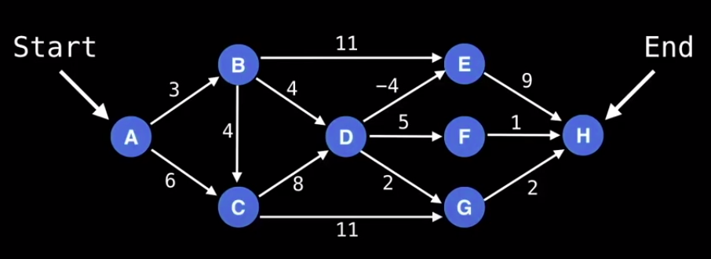

Let's assume this graph above represents a road system, and we are at Node A and want to get to Node H, our shortest path algorithm should be able to find us a list of edges to follow that will lead us from Node A to Node H with minimal cost.

Lucky for us, many algorithms exist to solve the shortest path problem.

> **Algorithms:** `BFS` (for unweighted graphs), `Dijkstra's`, `Bellman-Ford`, `Floyd-Warshall`, `A*` and many more.

---

## Connectivity Problem

As simple as it sounds connectivity is a big issue in Graph Theory.

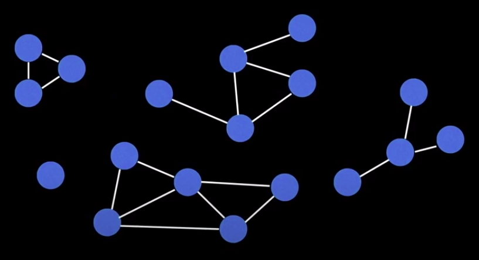

The problem can be simplified to: **Does there exist a path between Node A and Node B?**

In this scenario, we don't care about the minimum cost, we just want to know, can one node reach another node.

A typical solution to this problem is to use:

- A **[Union-Find](https://www.geeksforgeeks.org/union-find/)** Data Structure
- Do a very basic search algorithm like a DFS (Depth-First Search) or a BFS (Breadth-First Search)

---

## Negative Cycles Problem

Another common problem is detecting negative cycles in a directed graph. Sometimes we are dealing with graphs that have negative edge weights and we need to know if a negative cycle exists, because if this does, it can throw everything off.

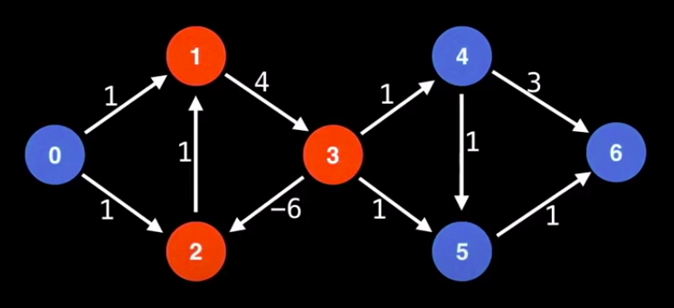

In this graph, Nodes 1, 2 and 3 form a negative cycle because if you cycle through these nodes, you end up with a cost of **`-1`** if you add up all the edge weights. In fact, you can cycle endlessly, getting smaller and smaller costs. In the context of finding the shortest path, a negative cycle is like a trap that you can never escape.

However there are some contexts, where negative cycles are beneficial. Suppose we are trading currencies across an exchange or multiple exchanges. Currency prices try to remain consistent throughout the day across exchanges such as, trading USD to Euros or CAD to Yen. But sometimes, there are inconsistencies in the currency exchange prices.
This makes it possible to do something called an **arbitrage**, which cycles through multiple currencies exchanging one currency for another and coming back to the original currency with more money than you originally started, at a risk free gain. This is something we can use Graph Theory for, because it uses detecting negative cycles.

There are two well-known algorithms that can detect negative cycles: `Bellman Ford` and `Floyd-Warshall`.

---

## Strongly Connected Components

Another problem that comes up now and again is finding strongly connected components within a graph. This is analogous to finding connected components of an undirected graph but for directed graphs.

Strongly Connected Components (SCC) can be thought of as self-contained cycles within a directed graph where every vertex (node) in a given cycle can reach every other vertex in the same cycle.

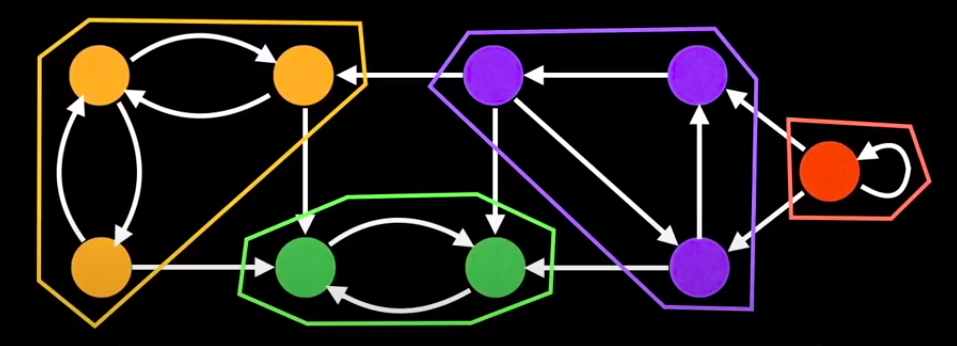

This is very useful in algorithms as an intermediary step. So it's important to know how to find these Strongly Connected Components.

There are many very elegant algorithms to do so: `Tarjan's` Algorithm, `Kosaraju's` Algorithm

---

## Travelling Salesman Problem

You probably won't go through your Computer Science career without hearing about the Travelling Salesman problem. The TSP is a problem of having `n` cities and the distances between each of them and finding the shortest path that visits each city and comes back to the original city at the minimum cost.

> **"Given a list of cities and the distances between each of the pair of cities, what is the shortest possible route that visits each city exactly once and returns to the origin city."** - Wiki

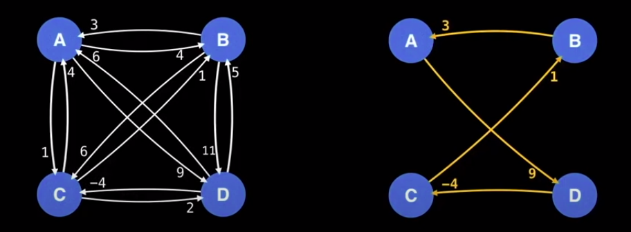

**For example:**

In the diagrams above, if the graph to the left denotes the TSP, a possible solution is the graph to the right, which has a cost of 9.

The Travelling Salesman problem is NP-Hard, meaning it's a very computationally challenging problem. This is unfortunate because the TSP has several very important applications.

Some famous algorithms we can use to solve this problem are:

- `Held-Karp` with Dynamic Programming
- `Branch and Bound`
- One of many approximation algorithms such as the `Ant Colony Optimization`

---

## Bridges

The next problem you may encounter is finding Bridges in a Graph.

A **`Bridge`** / **`Cut Edge`** is any edge in a graph whose removal increases the number of connected components in the graph.

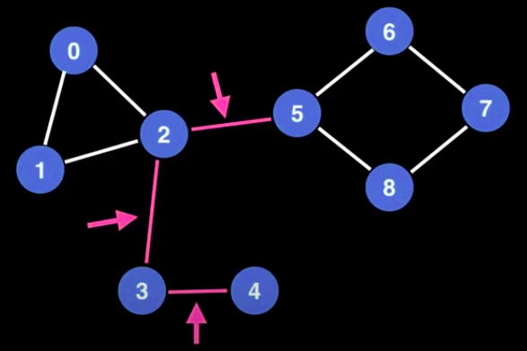

In the graph above, the edges highlighted in pink are Bridges.

Bridges are important in Graph Theory because they often hint at weak points, bottlenecks or vulnerabilities in a graph.

Think of your graph as a telephone network or a set of bridges between islands, you can immediately see the usefulness of detecting bridges.

---

## Articulation Points

Related to bridges but not the same are Articulation Points.

An **`Articulation Point`** / **`Cut Vertex`** is any node in a graph whose removal increases the number of connected components in the graph.

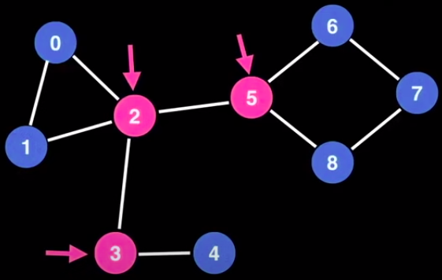

In the graph above, the three nodes highlighted in pink are Articulation Points.

---

## Minimum Spanning Tree (MST)

A **`Minimum Spanning Tree (MST)`** is a subset of the edges of a connected, edge-connected graph that connects all the vertices together, without any cycles and with the minimum possible total weight.

So in summary, it's a Tree, meaning it has no cycles and it spans the graph at a minimum cost, hence why we give it the name **`Minimum Spanning Tree`**.

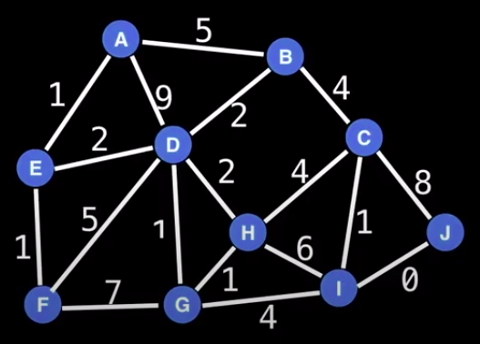

For example, in the graph above, one of the possible Minimum Spanning Trees is this graph below with a least cost of 14.

> **Note:** All Minimum Spanning Trees of a graph have the same minimal cost but are not necessarily identical.

**Practical Applications:**

Minimum Spanning Trees are seen in lot of different applications in Computer Science including:

- Designing a Least Cost Network
- Circuit Design
- Transportation Networks
- Approximation Algorithms that rely on Minimum Spanning Trees

**Algorithms:**

Algorithms used to find the Minimum Spanning Tree of a graph:

- `Kruskal's`
- `Prim's`
- `Boruvka's`

---

## Flow Network - Max Flow

This is probably the most fascinating Graph Theory problem and it is about finding the maximum flow through a special type of graph called a **`Flow Network`**.

Flow Networks are networks where edge weights represent capacities in some sense.
Capacities may be things like:

- the maximum amount of cars that can fit on a road
- the maximum amount of volume that can flow through a pipe
- the maximum number of boats a river can sustain without destroying the environment

In these types of Flow Networks, we often find ourselves asking the question:

> **With an infinite input source (cars, oil, boats, etc.) how much `flow` can we push through the network (assuming we start at some Source node and try to make it to some Sink node)?**

This question is important because at some point there is bound to be some bottleneck somewhere in our flow graph that limits the amount of stuff that can we can have travelling on the network, making it from Point A to Point B.

The maximum flow will then represent things like:

- The volume of oil allowed to flow through the pipes
- The number of vehicles that a bridge can support at the same time
- The maximum number of boats allowed on a river

With this maximum flow problem we can identify the bottlenecks that slow down the whole network and fix the edges that have lower capacities.

---

# Depth-First Search

## Overview

The **`Depth-First Search (DFS)`** is a core algorithm in Graph Theory and is often used as a building block for other algorithms. It is a traversal algorithm and the most fundamental search algorithm used to explore nodes and edges of a graph. It is really easy to code and runs with a time complexity of **`O(V+E)`** which is directly proportional to the size of the graph.

By itself the `DFS` isn't all that useful, but when augmented to perform other tasks such as count connected components, determine connectivity or find bridges/articulation points, then DFS really shines.

## Basic DFS

As the name suggests, a DFS plunges depth first into a graph without regard for which edge it takes next until it cannot go any further at which point it backtracks and continues.

---

# Has

In this problem, we will be given a graph and a source and destination node.
We have to return true or false indicating whether the graph can be traversed from the source node to the destination node.

---

# Connected Components

Sometimes a graph is split into multiple components. It's useful to be able to identify and count these components.
